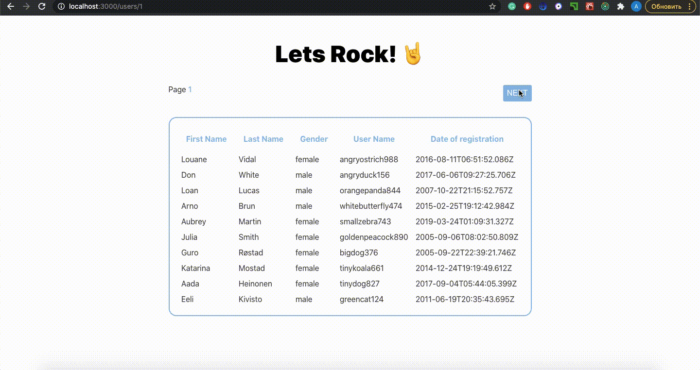

# Users Table
Users Table is a simple extendable SPA created using ReactJS. It represents a table of user data fetched from randomusers.me API.

## Demonstration

Technologies used:
* React
* SCSS
* Redux/redux-thunk

## Features
Users Table supports such features:

* Users information is fetched from: [randomuser.me](https://randomuser.me/)
* The fetching process is indicated to the user
* Fetched users information is preserved in the redux store
* Pagination - "Next" and "Previous" buttons fetch next/pevious 10 users
* Current table page number is shown
* The current visible page is persisted and available after page reload
* Data is managed by LocalStorage
* Changing the page updates the URL with the current page number

## How To Use

# Prym Application Template (User Table)

## Available Scripts

In the project directory, you can run:

### `yarn start`

Runs the app in the development mode.\
Open [http://localhost:3000](http://localhost:3000) to view it in the browser.

The page will reload if you make edits.\
You will also see any lint errors in the console.

